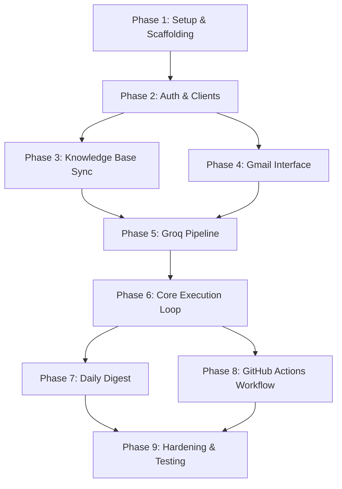

# Tasks: Gmail Customer Query Triage & Draft Agent

This document lists the atomic implementation tasks for the Gmail Triage & Draft Agent, phased by dependency.

---

## Dependency Graph (High-Level Phase Flow)


---

## Phase 1: Environment Setup & Scaffolding

### `TSK-1.1`: Initialize Directory Structure
- [x] **Description**: Create standard repository directory structure:
  - `src/` (for application code)
  - `tests/` (for unit/integration tests)
  - `knowledge/` (for manifest and extracted cache files)
  - `config/` (for config settings and templates)
- [x] **Dependencies**: None
- [x] **Verification**: Directories exist locally.

### `TSK-1.2`: Configure Project Dependencies
- [x] **Description**: Initialize `requirements.txt` (Python) or `package.json` (Node.js) with required packages:
  - Google API client library (`google-api-python-client`, `google-auth-oauthlib`)
  - Groq SDK (`groq`)
  - PDF parser (`pypdf` or equivalent)
  - DOCX parser (`python-docx` or equivalent)
  - Testing library (`pytest`)
  - Environment variables loader (`python-dotenv` or similar)
- [x] **Dependencies**: `TSK-1.1`
- [x] **Verification**: Successfully install dependencies locally using package manager.

### `TSK-1.3`: Configuration & Settings Module
- [x] **Description**: Create `src/config.py` to parse, validate, and load environment variables/secrets. Define default configurable constants:
  - Gmail label names (`Agent-Processed`, `Needs-Human`)
  - Google Drive Folder ID
  - Groq models to use (Stage 1 triage, Stage 2 drafting)
  - Digest recipient email
- [x] **Dependencies**: `TSK-1.2`
- [x] **Verification**: Run unit test to verify config correctly loads mock env values or defaults.


---

## Phase 2: Authentication & Service Clients

### `TSK-2.1`: Implement Google OAuth Helper
- [x] **Description**: Write code in `src/auth.py` to load Client ID, Client Secret, and Refresh Token from environment and return Google OAuth credentials.
- [x] **Dependencies**: `TSK-1.3`
- [x] **Verification**: Run script that fetches an active Access Token using the credentials and logs success.

### `TSK-2.2`: Initialize Gmail and Google Drive Clients
- [x] **Description**: Implement functions in `src/google_clients.py` that instantiate and return initialized service objects for Gmail API (`gmail`, `v1`) and Google Drive API (`drive`, `v3`).
- [x] **Dependencies**: `TSK-2.1`
- [x] **Verification**: Instantiate clients using mock credentials and check that they are valid objects.

### `TSK-2.3`: Initialize Groq Client
- [x] **Description**: Write `src/groq_client.py` to initialize the Groq client with the API key from configuration.
- [x] **Dependencies**: `TSK-1.3`
- [x] **Verification**: Simple connection check tool or mock validation in unit test.

---

## Phase 3: Knowledge Base Synchronization

### `TSK-3.1`: List Drive Folder Files
- [x] **Description**: Implement `src/kb_sync.py:list_drive_files()` to query the configured Google Drive folder and return details of all files (`id`, `name`, `modifiedTime`).
- [x] **Dependencies**: `TSK-2.2`
- [x] **Verification**: Fetch a list of files from a test Drive folder.

### `TSK-3.2`: Implement Local Cache Manifest Manager
- [x] **Description**: Create functions in `src/manifest.py` to load and save `knowledge/manifest.json`, which tracks file records:
  ```json
  {
    "files": {
      "file_id": {
        "name": "filename.pdf",
        "modifiedTime": "2026-06-13T12:00:00Z"
      }
    }
  }
  ```
- [x] **Dependencies**: `TSK-1.1`
- [x] **Verification**: Manifest file is created/updated on local disk when functions are run.

### `TSK-3.3`: Build PDF Text Extractor
- [x] **Description**: Implement `src/extractors/pdf.py` to extract raw text content from a PDF file buffer. Ensure layout structures/words are cleanly read.
- [x] **Dependencies**: `TSK-1.2`
- [x] **Verification**: Run extractor on a sample multi-page PDF and verify extracted text is returned as string.

### `TSK-3.4`: Build DOCX Text Extractor
- [x] **Description**: Implement `src/extractors/docx.py` to extract raw text content from a DOCX file buffer.
- [x] **Dependencies**: `TSK-1.2`
- [x] **Verification**: Run extractor on a sample DOCX document and verify extracted text.

### `TSK-3.5`: Implement KB Synchronization Engine
- [x] **Description**: Combine tools in `src/kb_sync.py` to orchestrate sync:
  1. Fetch file list from Drive (`TSK-3.1`).
  2. Compare with local manifest (`TSK-3.2`).
  3. For new/modified files, download, run appropriate extractor (`TSK-3.3`/`TSK-3.4`), and save output to `knowledge/extracted/<file_id>.txt`.
  4. For deleted files, remove text file from disk and entry from manifest.
  5. Update and write back `knowledge/manifest.json`.
- [x] **Dependencies**: `TSK-3.1`, `TSK-3.2`, `TSK-3.3`, `TSK-3.4`
- [x] **Verification**: Sync successfully updates local cache when files are added/edited in Drive.

### `TSK-3.6`: Concatenated KB Reader
- [x] **Description**: Implement `src/kb_sync.py:load_knowledge_base()` that reads all cached text files in `knowledge/extracted/` and concatenates them with file name separators to be used as context.
- [x] **Dependencies**: `TSK-3.5`
- [x] **Verification**: Returns consolidated string of all files under knowledge base.

---

## Phase 4: Gmail Interface

### `TSK-4.1`: Fetch Candidate Messages
- [x] **Description**: Implement `src/gmail_service.py:fetch_candidate_messages()` to search the inbox for messages that do not have the `Agent-Processed` label.
- [x] **Dependencies**: `TSK-2.2`
- [x] **Verification**: Returns list of message details matching the Gmail search query `-label:Agent-Processed label:INBOX`.

### `TSK-4.2`: Filter Incoming Messages
- [x] **Description**: Implement helper to verify that a candidate message was sent to the user (not by the user themselves).
- [x] **Dependencies**: `TSK-4.1`
- [x] **Verification**: Filters out messages where the `From` header matches the owner's email address.

### `TSK-4.3`: Inspect Thread for Replies
- [x] **Description**: Implement thread check: for a candidate message's thread, verify that no message sent *after* the candidate is from the owner (human reply).
- [x] **Dependencies**: `TSK-4.1`
- [x] **Verification**: Given a thread ID, return `True` if a human has replied, else `False`.

### `TSK-4.4`: Inspect Thread for Existing Drafts
- [x] **Description**: Check if a draft reply already exists on the thread containing the candidate message.
- [x] **Dependencies**: `TSK-4.1`
- [x] **Verification**: Queries Gmail drafts using thread ID; returns `True` if draft exists, else `False`.

### `TSK-4.5`: Update Message Labels
- [x] **Description**: Implement label application module `src/gmail_service.py:apply_labels(message_id, add_labels, remove_labels)`.
- [x] **Dependencies**: `TSK-2.2`
- [x] **Verification**: Apply `Agent-Processed` and `Needs-Human` labels to individual messages using Gmail API.

### `TSK-4.6`: Create Gmail Draft Reply
- [x] **Description**: Implement `src/gmail_service.py:create_draft_reply(message_id, thread_id, reply_body)`. Construct raw email draft containing headers:
  - `Subject` (prefix "Re: " to parent subject if not already present)
  - `In-Reply-To` (set to parent message ID)
  - `References` (parent message ID + any existing references)
  - `To` (parent message `Reply-To` or `From` address)
- [x] **Dependencies**: `TSK-2.2`
- [x] **Verification**: Call creates a draft reply that shows up correctly threaded in the user's Gmail interface.

---

## Phase 5: Groq AI Pipeline & Prompts

### `TSK-5.1`: Groq Client Wrapper with Exponential Backoff Retries
- [x] **Description**: Create helper wrapper `src/groq_client.py:call_groq_with_retry()` that retries Groq API requests on transient failures (rate limits, timeouts) up to 3 times.
- [x] **Dependencies**: `TSK-2.3`
- [x] **Verification**: Mock failing Groq API and verify it retries exactly 3 times before raising exception.

### `TSK-5.2`: Stage 1 — Cheap Triage Prompt
- [x] **Description**: Design prompt in `src/prompts.py` for classifying incoming text as `CUSTOMER_QUERY` or `NOT_QUERY` (receipts, notifications, spam, internal mail).
- [x] **Dependencies**: `TSK-5.1`
- [x] **Verification**: Test with mock emails (receipts, marketing, customer queries) and verify Groq model returns classification accurately.

### `TSK-5.3`: Stage 2 — Grounded Drafting Prompt
- [x] **Description**: Design prompt in `src/prompts.py` for answering queries. Require model to:
  1. Determine if the provided knowledge base context is sufficient to answer.
  2. If sufficient, reply grounded *only* in that text.
  3. If not, explicitly output a specific token (e.g., `[UNANSWERED]`).
  4. Append placeholder signature block: `[SIGNATURE_PLACEHOLDER — to be replaced with team's standard sign-off]`.
- [x] **Dependencies**: `TSK-5.1`
- [x] **Verification**: Test with queries inside and outside the KB context; ensure model does not hallucinate and correctly flags unanswered queries.

### `TSK-5.4`: Pipeline Triage & Draft Coordinator
- [x] **Description**: Implement `src/pipeline.py:process_email(message_text, thread_context, kb_text)` which runs Stage 1, then conditionally Stage 2. Returns status (`SKIPPED_NOT_QUERY`, `DRAFT_GENERATED`, or `NO_ANSWER_FOUND`) and reply body if generated.
- [x] **Dependencies**: `TSK-5.2`, `TSK-5.3`
- [x] **Verification**: Unit tests verify flow returns expected statuses for various mock inputs.

---

## Phase 6: Core Execution Loop

### `TSK-6.1`: Main Process Orchestrator
- [x] **Description**: Implement `src/main.py:run_agent()` that orchestrates the execution flow:
  1. Synchronize the Knowledge Base (`TSK-3.5`).
  2. Load concatenated KB text (`TSK-3.6`).
  3. Fetch candidates (`TSK-4.1`).
  4. For each candidate:
     - Check sender, thread replies, existing drafts (`TSK-4.2`, `TSK-4.3`, `TSK-4.4`). If invalid, label `Agent-Processed` and skip.
     - Run Groq pipeline (`TSK-5.4`).
     - If `DRAFT_GENERATED`: create Gmail draft (`TSK-4.6`) and label `Agent-Processed` (`TSK-4.5`).
     - If `NO_ANSWER_FOUND`: label `Needs-Human` and `Agent-Processed`.
     - If `SKIPPED_NOT_QUERY`: label `Agent-Processed`.
- [x] **Dependencies**: `TSK-3.5`, `TSK-3.6`, `TSK-4.1` to `TSK-4.6`, `TSK-5.4`
- [x] **Verification**: Run full pipeline with mocks and verify it processes all emails correctly.

### `TSK-6.2`: Stats Tracker and Persistent Local File
- [x] **Description**: Implement `src/stats.py` to record execution statistics (processed, drafts, flagged, skipped, errors) for each run, writing to `knowledge/daily_stats.json`.
- [x] **Dependencies**: `TSK-1.1`
- [x] **Verification**: JSON structure updates correctly with incremental numbers after mock runs.

---

## Phase 7: Daily Digest

### `TSK-7.1`: Digest Schedule Trigger Check
- [x] **Description**: Check if 24 hours have elapsed since the last digest or check if it's the first run after midnight to trigger the digest send.
- [x] **Dependencies**: `TSK-6.2`
- [x] **Verification**: Function returns `True` when digest trigger condition is met, `False` otherwise.

### `TSK-7.2`: Digest Email Content Generator
- [x] **Description**: Generate body of the digest email containing stats for the last 24h: count of processed, drafted, skipped, flagged messages, and error logs.
- [x] **Dependencies**: `TSK-6.2`
- [x] **Verification**: Returns formatted markdown or HTML string with stats.

### `TSK-7.3`: Send Digest Email
- [x] **Description**: Use Gmail API to send the generated digest email directly to `DIGEST_RECIPIENT_EMAIL`. Reset `knowledge/daily_stats.json` after successful send.
- [x] **Dependencies**: `TSK-2.2`, `TSK-7.2`
- [x] **Verification**: Digest email is received by recipient; local stats are cleared.

---

## Phase 8: GitHub Actions Workflow

### `TSK-8.1`: Hourly Actions Cron Configuration
- [x] **Description**: Create `.github/workflows/triage-agent.yml` to trigger every hour. Include steps to set up runner, install dependencies, pull changes, run `src/main.py`.
- [x] **Dependencies**: `TSK-6.1`
- [x] **Verification**: Workflow file validates against GHA syntax schema.

### `TSK-8.2`: Commit Back Step in GHA
- [x] **Description**: Add Git steps to workflow to check for changes in `knowledge/manifest.json`, `knowledge/extracted/`, and `knowledge/daily_stats.json`. Commit and push updates back to the branch.
- [x] **Dependencies**: `TSK-8.1`
- [x] **Verification**: Local changes to tracked paths are pushed automatically when GHA runner finishes.

### `TSK-8.3`: README Setup Instructions
- [x] **Description**: Create README detailing required GitHub Secrets, Gmail Labels creation, and Google OAuth credentials step-by-step setup.
- [x] **Dependencies**: None
- [x] **Verification**: Readable instructions file in repo root.

---

## Phase 9: Hardening & End-to-End Testing

### `TSK-9.1`: Unit & Mock Tests Suite
- [x] **Description**: Create unit tests in `tests/` covering parsing logic, prompt parsing, error retries, and config loader.
- [x] **Dependencies**: `TSK-1.2`
- [x] **Verification**: All tests pass when running `pytest`.

### `TSK-9.2`: Dry Run Mode Integration Test
- [x] **Description**: Implement a CLI option `--dry-run` that does everything except modify Gmail (no labeling, no draft creation, only printing proposed actions to stdout).
- [x] **Dependencies**: `TSK-6.1`
- [x] **Verification**: Running `python src/main.py --dry-run` runs successfully without modifying Gmail inbox.
